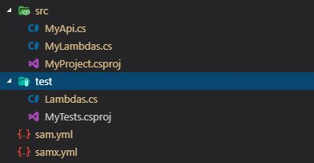

[](https://travis-ci.com/NachoColl/dotnet-cf4dotnet-templates)

Some demo templates to build AWS Api Gateway and Lambdas dotNET core projects that want to use the tool [Cloudformation4dotNET](https://github.com/NachoColl/dotnet-cf4dotnet) to deploy on AWS by using Cloudformation templates.

## How to Install

```
dotnet new -i NachoColl.Cloudformation4dotNET.Templates
```

## Available Templates

### cf4dotnet

A simple demo project to build your dotNET API Gateway and Lambdas.

```bash
dotnet new cf4dotnet -n MyDemoProject -as DemoAssembly -t AWSTagExample
```



